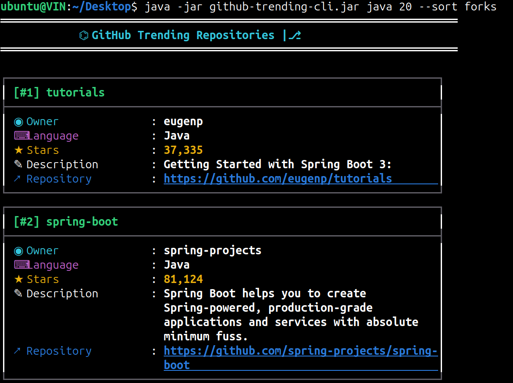
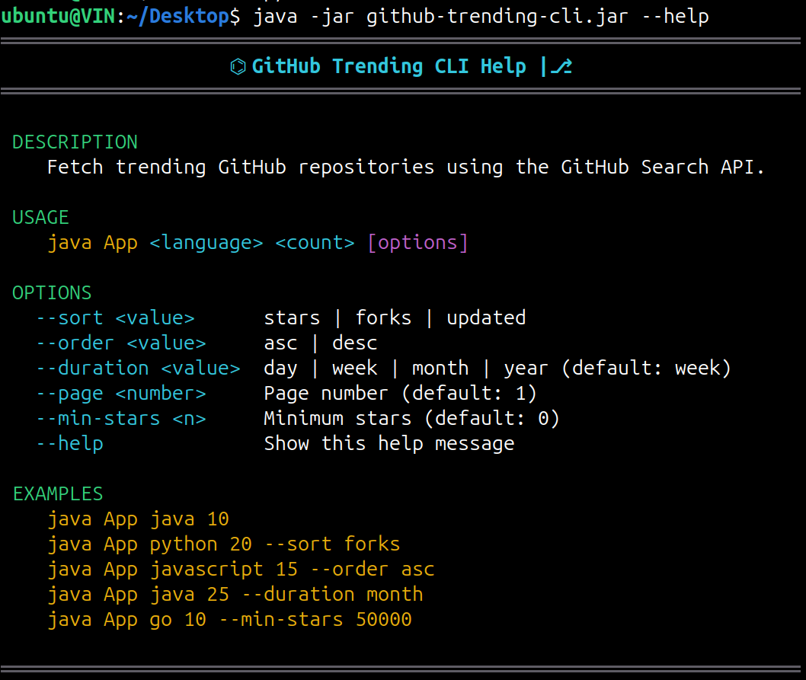

# 🚀 GitHub Trending CLI 📈

[](https://github.com/Vinyas24/Github-Trending-CLI/actions/workflows/maven.yml)


[](https://github.com/Vinyas24/Github-Trending-CLI/releases/latest)

A Java-based Command Line Interface (CLI) application that fetches trending GitHub repositories using the GitHub Search API. It supports filtering, sorting, pagination, and customizable search options through a clean and user-friendly terminal interface.

The application allows users to search repositories by programming language and customize results using sorting, ordering, pagination, and filtering options.

---

## ✨ Features

- 🔍 Search repositories by programming language
- 📅 Filter repositories by creation date (day, week, month, year)
- ⭐ Sort by stars, forks, or last updated
- 📈 Support ascending and descending order
- 📄 Pagination support
- ⭐ Filter repositories by minimum stars
- 🧩 Builder Pattern for API URL construction
- 🎨 Rich terminal UI with colors and boxed output
- ⚠️ Custom exception handling
- 📖 Built-in `--help` command
- 📦 Standalone executable JAR

---

## 📂 Project Structure

```
src
└── main
    └── java
        └── com.githubtrends
            ├── builder
            ├── cli
            ├── client
            ├── exceptions
            ├── model
            ├── service
            ├── ui
            └── App.java
```

---

## 🛠️ Technologies Used

- Java 21
- Maven
- GitHub Search REST API
- Jackson Databind
- Java HttpClient
- JUnit 5
- Mockito
- GitHub Actions

---

## 📦 Installation

Clone the repository

```bash
git clone https://github.com/Vinyas24/Github-Trending-CLI.git
```

Move into the project

```bash
cd Github-Trending-CLI
```

Compile the project

```bash
mvn clean compile
```

---

## 📥 Download

Download the latest executable JAR from the [Releases](https://github.com/Vinyas24/Github-Trending-CLI/releases/) page.

Run it using:

```bash
java -jar github-trending-cli.jar java 10
```

---

## ▶️ Running the Application

Basic Usage

```bash
java -jar github-trending-cli.jar <language> <count>
```

Example

```bash
java -jar github-trending-cli.jar java 10
```

---

## ⚙️ Available Options

| Option | Description | Default |
|---------|-------------|----------|
| `--sort` | stars, forks, updated | stars |
| `--order` | asc, desc | desc |
| `--duration` | day, week, month, year | week |
| `--page` | Page number | 1 |
| `--min-stars` | Minimum repository stars | 0 |
| `--help` | Show help information | - |

---

## 💡 Examples

Fetch 10 Java repositories

```bash
java -jar github-trending-cli.jar java 10
```

Sort by forks

```bash
java -jar github-trending-cli.jar java 10 --sort forks
```

Ascending order

```bash
java -jar github-trending-cli.jar java 10 --order asc
```

Second page

```bash
java -jar github-trending-cli.jar java 10 --page 2
```

Repositories with at least 50,000 stars

```bash
java -jar github-trending-cli.jar java 100 --min-stars 50000
```

Repositories created this month

```bash
java -jar github-trending-cli.jar java 20 --duration month
```

Combine multiple options

```bash
java -jar github-trending-cli.jar java 20 --sort stars --order desc --duration month --page 2 --min-stars 10000
```

Display help

```bash
java -jar github-trending-cli.jar --help
```

---

## 🖥️ Sample Output
### Repository Output

<p align="center">
  
</p>

### Help

<p align="center">
  
</p>

---

## ⚠️ Error Handling

The application validates user input and displays meaningful error messages.

Examples:

- Invalid repository count
- Invalid sort option
- Invalid order option
- Invalid page number
- Invalid duration value
- Invalid minimum stars value
- Unknown CLI flags
- GitHub API rate limit exceeded
- Authentication failure
- GitHub server errors

---

## 🏗️ Design Highlights

The project follows clean object-oriented design principles.

- Builder Pattern for GitHub API query construction
- Dedicated CLI argument parser with validation
- Service layer for repository filtering
- Separate UI layer for formatted terminal output
- Custom exception hierarchy
- Immutable CLI argument model

---

## 📚 Future Improvements

- GitHub Personal Access Token support
- Repository topics filter
- Export results to JSON/CSV
- Search by organization or user
- Docker support
- Interactive mode

---

## 🤝 Contributing

Contributions, issues, and suggestions are welcome.

Feel free to fork the repository and submit a pull request.

---

## 📄 License

This project is licensed under the MIT License.

---

## 👨‍💻 Author

**Vinyas**

GitHub: **[@Vinyas24](https://github.com/Vinyas24)**